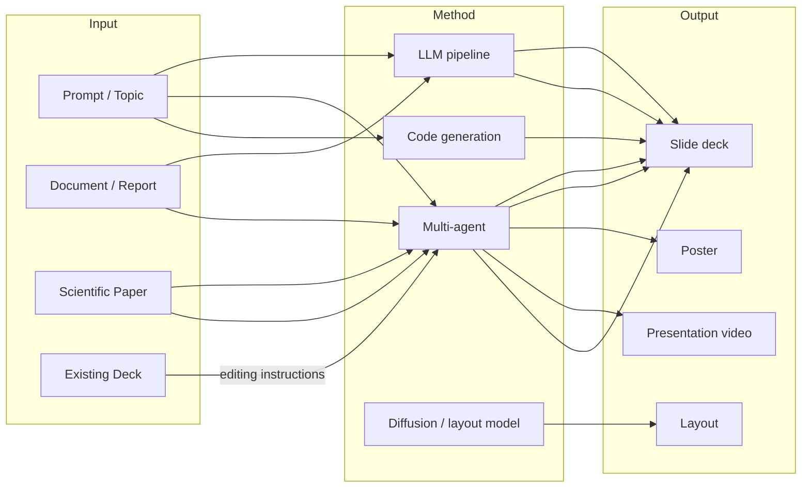

# Taxonomy of Presentation Generation

This page explains how the list is organized, so you can quickly find the right section — both when browsing and when [contributing](../CONTRIBUTING.md) a new entry.

## The big picture

Research and tooling in this space differ mainly along two axes: **what goes in** (a short prompt, a long document, a scientific paper) and **what comes out** (a slide deck, a poster, a layout, or even a narrated video).

## Section guide

| Section | Input → Output | Typical work |
|---------|----------------|--------------|
| [Prompt / Topic → Slides](../README.md#prompt--topic--slides) | Short prompt → full deck | PPTAgent, AutoPresent, EvoPresent |
| [Document → Slides](../README.md#document--slides) | Long document / paper → structured deck (or narrated video) | DOC2PPT, D2S, SlideGen, Paper2Video |
| [Paper / Document → Poster](../README.md#paper--document--poster) | Paper → research or artistic poster | Paper2Poster, PosterGen, P2P |
| [Slide Editing & Agentic Manipulation](../README.md#slide-editing--agentic-manipulation) | Existing deck + NL instruction → edited deck | Talk to Your Slides, PPTArena |
| [Layout Generation](../README.md#layout-generation) | Elements → positioned canvas | PosterLlama, ReLayout, AeSlides |
| [Evaluation](../README.md#evaluation) | Generated output → quality scores | PPTEval, SlideAudit, PresentBench |
| [Datasets & Benchmarks](../README.md#datasets--benchmarks) | Training / evaluation data | SlidesBench, SciDuet, TSBench |
| [Open-Source Projects](../README.md#open-source-projects) | Runnable generators, authoring frameworks, PPTX libraries | Presenton, Slidev, python-pptx |
| [Commercial Products](../README.md#commercial-products) | Hosted products with AI generation | Gamma, Copilot, 通义 |

## Common method paradigms

These labels appear throughout the paper tables:

- **LLM pipeline** — a fixed sequence of LLM calls (outline → content → layout), possibly with self-verification loops.
- **Multi-agent / agentic** — multiple specialized roles (researcher, designer, reviewer) collaborate, often iterating on rendered output.
- **Code generation** — the model emits rendering code (python-pptx, HTML, Slidev/Markdown) instead of directly producing a file, making output editable and verifiable.
- **Layout models** — diffusion models, GNNs, or fine-tuned (M)LLMs that predict element positions and sizes on a canvas.
- **RL with verifiable rewards** — training against measurable aesthetics (whitespace, collisions, balance) or task success.

If your entry doesn't fit any section cleanly, open an issue with the *"Suggest a resource"* template and we'll figure out where it belongs.
